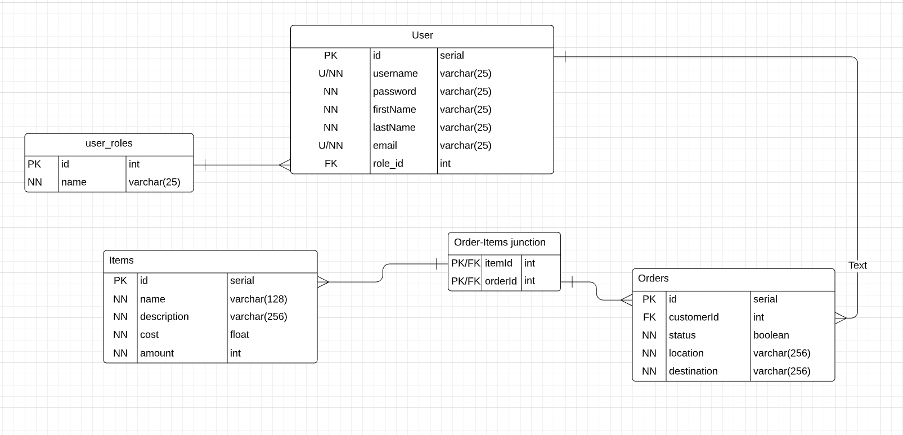

The purpose of this project is to create a basic online ordering system API, incorporating TypeScript, PostGreSQL, node-postgre, express, jest, and Git SCM. The primary functionality of this API is to create, read, update, and delete data from a database created in PostGreSQL, hosted by AWS. The method used to interface with the API is HTTP. In this project, there are three data types: Users, Items, and Orders. Each user is to have 0-n orders, and each order is to have 1-n items.

